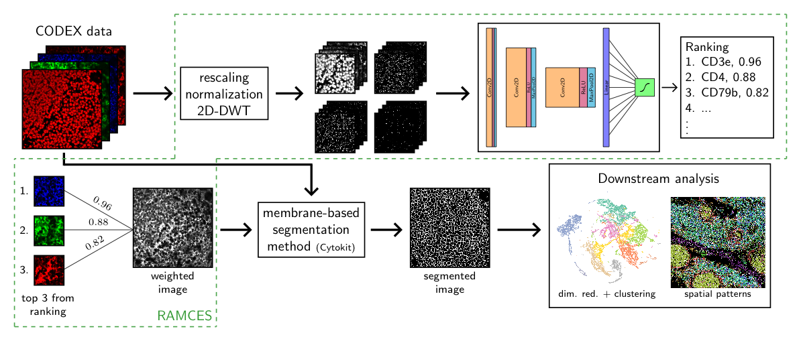

# RAMCES

RAnking Markers for CEll Segmentation



## Installation

[//]: # (instructions, typical install time)

### Dependencies

[//]: # (all software dependencies and operating systems)

## Using RAMCES to output marker rankings and weighted images

This section describes how you can use RAMCES to rank markers and create weighted images on your own data. To do this, use the `rank_markers.py` script. There are a number of arguments that you must specify; you can see these options by running

`python rank_markers.py -h`

### Input file format

Before you can use RAMCES, you will need to have the following files prepared:

1. The trained model file (`--model-path`)
    
    By default, this will be the already-trained CNN model `models/trained_model.h5`. Unless you have your own trained model that you want to use, you do not need to specify anything here.

2. The image data, CODEX or otherwise (`--data-dir`)

    Put all of the data in a single directory. The data *must* be formatted in a specific way in order to use this script. Currently, it is formatted for images that are acquired in cycles (e.g. CODEX). In a future update of this repository, the allowed data input will be more flexible to accommodate a range of data formats.
    
    - There must be a single 2D TIFF file for each marker/protein for every tile in the dataset. This means that if there are 16 image tiles and 20 distinct proteins profiled, there would be 320 TIFF files in the data directory.
    - Each TIFF filename should contain the following patterns to specify the cycle and channel of each file (and hence specify the marker):
        - `tXXX` for cycle number, starting at 1
        - `cXXX` for channel number, starting at 1
        - The tile number should also be specified in some way, but there is no required pattern for this.
        - For example, the filename for a marker at cycle 3, channel 2 at tile 5 could be: `mydataset_0005_t003_c002.tif`

3. A CSV file with two columns listing the marker channel name and whether the channel should be scored by RAMCES (`--channels`)

    An example file with a total of 9 channels and 5 markers/proteins to input to RAMCES would look like:

    ```
    DAPI, False
    CD20, True
    CD4, True
    DAPI1, False
    CD45, True
    CD8, True
    DAPI2, False
    Podoplanin, True
    Blank, False
    ```

### Output

### Demo on CODEX data

[//]: # (instructions, expected output, expected run time for demo)

## Training your own models

A future update of this repository will include instructions on how to train a CNN model with your own data. This may be desirable if your data is dissimilar to the CODEX data RAMCES was originally trained on.

[//]: # (### Required input files)

